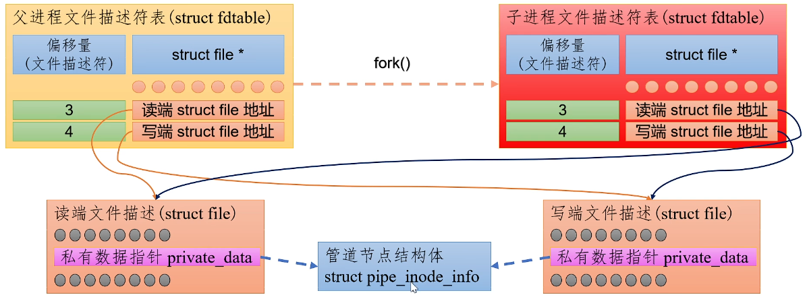

**管道本质上是一个内核维护的、固定大小的内存缓冲区**，它对外表现为两个文件描述符：
- 读端（`fd[0]`）：从此端读取数据
- 写端（`fd[1]`）：从此端写入数据
数据在管道中是**单向流动**的（从写端到读端），遵循**先进先出（FIFO）** 原则。

# 管道类型
| 类型             | 特点                   | 创建方式                   | 适用范围          |
| -------------- | -------------------- | ---------------------- | ------------- |
| **匿名管道**       | 无文件名，只能用于父子进程或相关进程之间 | `pipe()`               | 进程间有亲缘关系      |
| **命名管道（FIFO）** | 有文件名，存在文件系统中         | `mkfifo()` / `mknod()` | 任意进程（包括无亲缘关系） |


# 匿名管道
```c
#include <stdio.h>
#include <unistd.h>
#include <sys/wait.h>
#include <string.h>

int main() {
    int fd[2];
    pid_t pid;
    char buf[256];
    
    pipe(fd);
    pid = fork();
    
    if (pid == 0) {
        // 子进程：关闭读端，只写
        close(fd[0]);
        write(fd[1], "Hello from child", 17);
        close(fd[1]);
        _exit(0);
    } else {
        // 父进程：关闭写端，只读
        close(fd[1]);
        read(fd[0], buf, sizeof(buf));
        printf("父进程收到: %s\n", buf);
        close(fd[0]);
        wait(NULL);
    }
    return 0;
}
```
- `fd`是一个局部变量, 父进程和子进程都有一个`fd`, 且来面的内容完全一样. 既然是局部变量为什么可以通信呢, 因为`fork`创建子进程时, 同时增加了父进程所有文件的引用计数(可以理解为子进程复制了父进程的所有文件), 所以父子进程通过局部变量但却指向了相同的文件`struct file`对象, 从而实现了通讯
- 由于管道的单向流通, 父子进程必须各自关闭一个读端或一个写端, 从而避免管道数据紊乱



# 命名管道(`FIFIO_PIPE`)
命名管道（`Named Pipe`），在 `Linux` 中也被称为 **FIFO**（`First In First Out`），是一种特殊类型的文件。
- **本质**：与匿名管道一样，数据在内核缓冲区中流动。
- **关键区别**：它在文件系统中有一个**路径名**（如 `/tmp/myfifo`）。
- **访问方式**：不相关的进程也可以通过 `open()` 系统调用打开这个文件进行通信。

## 创建命名管道
### 命令行 & `Shell`脚本创建
- 命令行
```bash
# 创建 FIFO
mkfifo /tmp/myfifo

# 或指定权限
mkfifo -m 0666 /tmp/myfifo

# 查看文件类型（开头为 p 表示管道）
ls -l /tmp/myfifo
# prw-r--r-- 1 user user 0 Jun 22 10:00 /tmp/myfifo
```
- `Shell`脚本
```bash
#!/bin/bash
[ -p /tmp/myfifo ] || mkfifo /tmp/myfifo
```


### `C`语言创建
```c
#include <sys/stat.h>
#include <sys/types.h>

int main() {
    // 创建 FIFO，权限为 0666（rw-rw-rw-）
    if (mkfifo("/tmp/myfifo", 0666) == -1) {
        perror("mkfifo");
        return 1;
    }
    return 0;
}
```

## 基本读写示例(阻塞)
### 写端
```c
#include <stdio.h>
#include <fcntl.h>
#include <unistd.h>
#include <string.h>

#define FIFO_NAME "/tmp/myfifo"

int main() {
    int fd;
    char *msg = "Hello from writer!";
    
    // 以只写方式打开 FIFO（阻塞直到有读端打开）
    fd = open(FIFO_NAME, O_WRONLY);
    if (fd == -1) {
        perror("open");
        return 1;
    }
    
    write(fd, msg, strlen(msg) + 1);
    close(fd);
    return 0;
}
```

### 读端
```c
#include <stdio.h>
#include <fcntl.h>
#include <unistd.h>

#define FIFO_NAME "/tmp/myfifo"

int main() {
    int fd;
    char buf[256];
    
    // 以只读方式打开 FIFO（阻塞直到有写端打开）
    fd = open(FIFO_NAME, O_RDONLY);
    if (fd == -1) {
        perror("open");
        return 1;
    }
    
    read(fd, buf, sizeof(buf));
    printf("Received: %s\n", buf);
    close(fd);
    return 0;
}
```

### 运行方式
```bash
# 先运行读端（会阻塞等待）
./reader &
# 再运行写端
./writer
# 输出：Received: Hello from writer!
```
- ==默认用读或写打开管道, 都是会阻塞直到另一端打开==


## 非阻塞模式
```c
#include <fcntl.h>

// 以非阻塞方式打开
int fd = open(FIFO_NAME, O_RDONLY | O_NONBLOCK);
if (fd == -1) {
    perror("open");
    return 1;
}
```
- 加上一个`O_NONBLOCK`即可